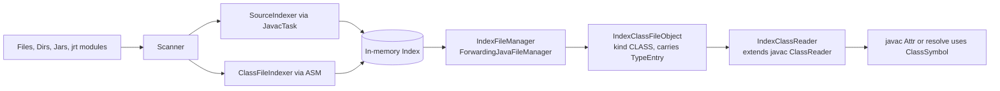

## Background & current state

- `java-indexing/src/main/java/ch/castleridge/javals/indexing/` is empty on disk (the old `IndexDecompilerMain.java` is gone). The pom still references `ch.castleridge.javals.indexing.cli.IndexDecompilerMain` as main class and already pulls in `asm` + `asm-tree` 9.7.
- `java-ls` depends on `java-indexing` and has `--add-exports jdk.compiler/com.sun.tools.javac.main=ALL-UNNAMED`. It ships a stub [`FileManager`](java-ls/src/main/java/ch/castleridge/javals/javac/FileManager.java) that implements `JavaFileManager` directly (not a Forwarding one yet) and a bare [`PathFileObject`](java-ls/src/main/java/ch/castleridge/javals/javac/PathFileObject.java).
- Per the user: the index is pure in-memory for now, and the ClassReader subclass populates `ClassSymbol`/`VarSymbol`/`MethodSymbol` directly (no ASM round-trip on the read path).

## Resource URIs (shared convention)

All entries address their origin with a single `URI`:
- Filesystem: `file:///...Foo.java` or `file:///...Foo.class`.
- Jar entries: `jar:file:/C:/Program%20Files/test.jar!/com/foo/Bar.class` (same as `JarURLConnection`).
- JRT entries: the jrt:/ URI produced by `URIs` of the JRT filesystem, e.g. `jrt:/java.base/java/lang/Object.class`.

## Architecture



## Part 1 - `java-indexing` index library (all new code)

All classes land under `ch.castleridge.javals.indexing`.

### 1.1 Model (`.model`)

A sealed hierarchy mirroring the TSV columns (but as typed records, not strings):

- `EntryKind { TYPE, FIELD, METHOD }`
- `sealed interface IndexEntry permits TypeEntry, FieldEntry, MethodEntry` with common fields: `URI resourceUri`, `String jvmOwnerName`, `int accessFlags`, `List<AnnotationRef> annotations`.
- `record TypeEntry(..., String signatureOrNull, String superJvm, List<String> interfacesJvm, List<FieldEntry> fields, List<MethodEntry> methods, List<String> innerTypeJvmNames)`.
- `record FieldEntry(..., String name, String descriptor, String declaredTypeJvm, String signatureOrNull)`.
- `record MethodEntry(..., String name, String descriptor, String returnTypeJvm, List<String> paramTypesJvm, List<String> throwsJvm, String signatureOrNull)`.
- `record AnnotationRef(String jvmName, Map<String,Object> values)` (keep minimal; enough to reconstruct compile-essential annotations like `@Deprecated`, `@FunctionalInterface`).

No disk format — all records stay in memory, allocated by the two indexers.

### 1.2 Index container (`.index`)

- `final class Index` with:
  - `ConcurrentMap<String /*jvmName*/, TypeEntry> byJvmName`
  - `ConcurrentMap<String /*packageJvm*/, List<TypeEntry>> byPackage` (built incrementally while adding)
  - `add(TypeEntry)` / `get(String jvmName)` / `listPackage(String packageJvm)`.
- Filters enforced at `add`: drop names ending `/module-info` or `/package-info`.

### 1.3 Source indexer (`.source`)

- `SourceIndexer.index(URI uri, CharSequence content, Index into)` parses a single `.java` file using `JavaCompiler.getTask(...).parse()` (no analyze) with an in-memory `SimpleJavaFileObject`, then walks `CompilationUnitTree` with a `TreePathScanner` converting `ClassTree` / `MethodTree` / `VariableTree` into entries.
- For types, resolve names qualified via the compilation unit's package + enclosing classes; emit JVM-style binary names with `$` separators.
- Descriptors are built from declared `Tree` types with a small type-name-to-descriptor helper that handles arrays, primitives, and returns raw JVM names for reference types (acceptable because index is context-free; unresolved references remain as source-level names).

### 1.4 Class-file indexer (`.bytecode`)

- `ClassFileIndexer.index(URI uri, InputStream in, Index into)` uses ASM's `ClassReader` + a single-pass `ClassVisitor` that emits a `TypeEntry` plus `FieldEntry`/`MethodEntry` from `visitField`/`visitMethod`. Use `SKIP_CODE | SKIP_DEBUG | SKIP_FRAMES` for speed.
- Pull generic signatures from the `signature` parameter.
- Collect annotations via `visitAnnotation` (descriptors, minimal constant values).

### 1.5 Scan driver (`.scan`)

- `sealed interface InputSource permits DirInput, JarInput, JrtInput`
  - `DirInput(Path root)` — recursive walk; dispatch by extension.
  - `JarInput(Path jar)` — iterate `JarFile` entries; build `jar:file:...!/...` URI.
  - `JrtInput(String moduleOrAll)` — use `FileSystems.getFileSystem(URI.create("jrt:/")).getPath("modules")` (same pattern as [`FileManager.listLocationsForModules`](java-ls/src/main/java/ch/castleridge/javals/javac/FileManager.java)).
- `Scanner.scanAll(List<InputSource>, Index)` may parallelize across files with a `ForkJoinPool`.
- Skip `module-info.*` and `package-info.*` up-front (by filename) before opening.

### 1.6 CLI (`.cli`)

- Recreate `IndexDecompilerMain` (referenced in [pom.xml](java-indexing/pom.xml)) as a minimal driver that parses argv into `InputSource`s, runs `Scanner`, then prints `index.size()` and timing. Keep its fully-qualified name so the shade plugin config doesn't need changes.

## Part 2 - `java-ls` javac integration (rewrite existing stubs)

### 2.1 `IndexFileManager` (replaces current [`FileManager`](java-ls/src/main/java/ch/castleridge/javals/javac/FileManager.java))

- `public class IndexFileManager extends ForwardingJavaFileManager<StandardJavaFileManager>` constructed with both a `StandardJavaFileManager` (from `ToolProvider.getSystemJavaCompiler().getStandardFileManager(...)`) and an `Index`.
- Override:
  - `list(Location, String pkg, Set<Kind>, boolean recurse)`:
    - If `kinds` contains `CLASS` and the location is `CLASS_PATH` / `SYSTEM_MODULES` / a module-oriented child, yield `IndexClassFileObject` for each `TypeEntry` in `index.listPackage(pkgJvm)`. Respect `recurse`.
    - Then chain `super.list(...)` so non-index sources/classes (e.g. user sources) still work.
  - `inferBinaryName(Location, JavaFileObject)` — return `entry.jvmName.replace('/', '.')` when the file is an `IndexClassFileObject`, otherwise delegate.
  - `hasLocation` / `getJavaFileForInput` — delegate, but also answer CLASS lookups from the index by jvm name.
- Preserves the module-oriented behavior currently hacked into `listLocationsForModules` by wrapping the standard manager's module layout.

### 2.2 `IndexClassFileObject` (replaces `PathFileObject`)

- `class IndexClassFileObject extends SimpleJavaFileObject`:
  - `kind = CLASS`, `uri = entry.resourceUri`, plus a strong reference to its `TypeEntry`.
  - `getName()` returns the jvm name; `toUri()` returns the original resource URI (file/jar/jrt).
  - `openInputStream()` throws `UnsupportedOperationException` — the `IndexClassReader` must recognize this type and never try to read bytes (fail loudly if it does, so bugs surface early).

### 2.3 `IndexClassReader extends com.sun.tools.javac.jvm.ClassReader`

Risk area — the key design point.

- Register in the javac `Context` before `JavacTask` is created:
  ```java
  Context context = new Context();
  IndexClassReader.preRegister(context, index);
  JavacTool.create().getTask(..., context);
  ```
  `preRegister` stores a factory under `ClassReader.classReaderKey` so `ClassReader.instance(context)` returns our subclass.

- Override the completion path. In OpenJDK 17, class loading goes through `ClassReader.readClassFile(ClassSymbol)` (called from `ClassFinder.fillIn`). Override:
  ```java
  @Override
  public void readClassFile(ClassSymbol c) throws BadClassFile {
      if (c.classfile instanceof IndexClassFileObject icfo) {
          fillFromIndex(c, icfo.entry);
      } else {
          super.readClassFile(c);
      }
  }
  ```
- `fillFromIndex(ClassSymbol c, TypeEntry e)` constructs the symbol's `type` (`ClassType` with type-params parsed from `signatureOrNull` via `Types`/`SigParser`), sets `supertype_field` and `interfaces_field` by resolving `superJvm`/`interfacesJvm` to other `ClassSymbol`s via `Symtab.enterClass(ModuleSymbol, Name)`, then creates:
  - `VarSymbol` for each `FieldEntry` with descriptor parsed via `Types.newMethodType(...)`-style helpers (or the existing `ClassReader.sigToType` machinery, accessible because we're a subclass).
  - `MethodSymbol` for each `MethodEntry` similarly.
  - `c.members_field` is populated with these symbols; `c.completer = Completer.NULL_COMPLETER`; `c.flags_field = entry.accessFlags`.
- Annotations: populate `c.getMetadata().setDeclarationAttributes(...)` only for a small allow-list of compile-affecting annotations (`Deprecated`, `FunctionalInterface`, `PolymorphicSignature`). Everything else can be skipped for now.
- The ability to reuse package-private helpers (`sigToType`, `readType`, `signatureBuffer`) is the main reason for subclassing rather than assembling symbols from the outside.

### 2.4 Additional `--add-exports`

Update `java-ls/pom.xml` compiler args:
- Already has `jdk.compiler/com.sun.tools.javac.main=ALL-UNNAMED`.
- Add: `com.sun.tools.javac.code`, `com.sun.tools.javac.jvm`, `com.sun.tools.javac.util`, `com.sun.tools.javac.comp`, `com.sun.tools.javac.file`, `com.sun.tools.javac.api` — all `=ALL-UNNAMED`. Document the matching `--add-exports` flags required at runtime in a README note.

## Part 3 - Verification

- Unit test in `java-indexing` that points `Scanner` at `JrtInput("java.base")` and asserts `java/lang/Object` and `java/util/List` appear with expected supers/members.
- Unit test in `java-ls` that builds an `Index` containing a single synthetic class `com/example/Hello` with one `greet()V` method, spins up a `JavacTask` on a source that calls `Hello.greet()`, and asserts `analyze()` completes with zero diagnostics (end-to-end proof that `IndexClassFileObject` + `IndexClassReader` resolve correctly).

## Risks / open questions to flag during build

- Exact signature of the ClassReader completion hook differs slightly between JDK 17 and later; the code targets JDK 17 per the parent POM's `maven.compiler.source=17`.
- Generic signature parsing is non-trivial; reusing javac's internal `sigToType` via subclassing is deliberate and should be preferred over re-implementing.
- Source indexer's type descriptors will be approximate for unresolved references (expected — the index is context-free). Consumers of the index must tolerate unresolved names, which is why the JVM-name strings in `TypeEntry`/`MethodEntry` are plain strings, not resolved `Symbol`s.
